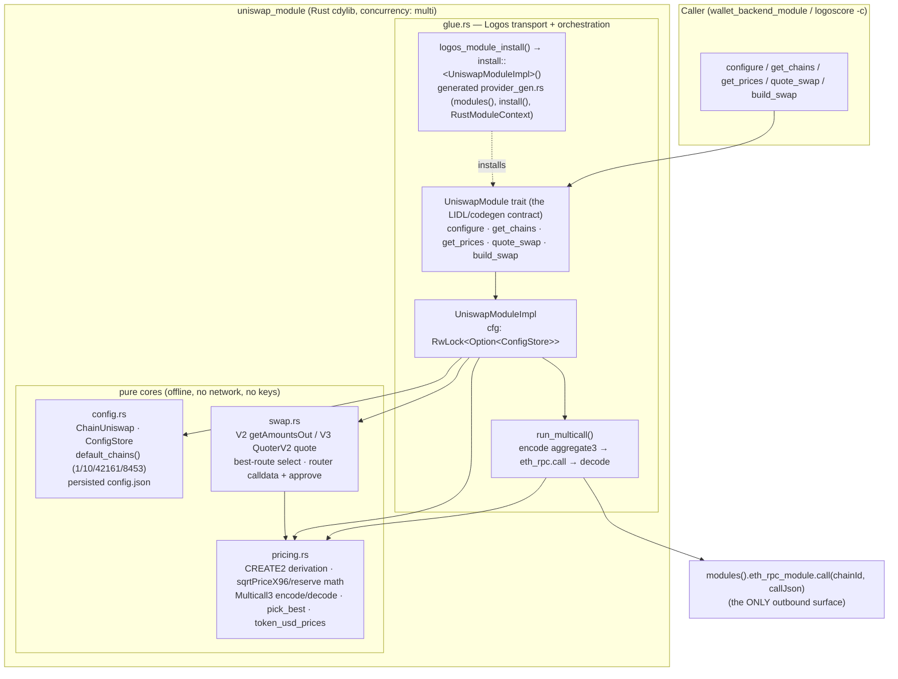
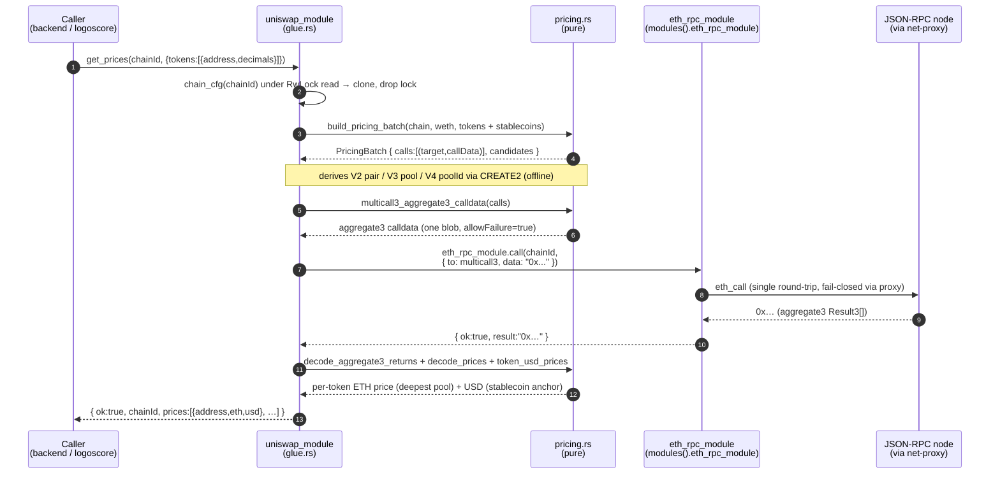

# `logos-evm-uniswap-module` — Specification & Reference

> Uniswap **price oracle and swap router** for the Logos multi-chain EVM wallet.
> Derives Uniswap V2/V3/V4 pool addresses **offline** (CREATE2), bundles every
> on-chain read into a **single Multicall3 `eth_call`** issued through
> `eth_rpc_module`, and returns best-rate token→ETH / token→USD prices plus
> V2/V3 swap-transaction building. Multi-chain, configurable, `concurrency:multi`.

---

## 1. Purpose & place in the EVM wallet

`logos-evm-uniswap-module` is a **Rust `cdylib` Logos module** that answers two
questions for the wallet: *"what is this token worth?"* and *"how do I swap it?"*.

It is the wallet's **market-data and routing layer**. It does **no networking and
holds no keys**. Instead it:

1. Derives Uniswap V2 pair / V3 pool / V4 pool-id addresses purely from chain
   config using **CREATE2** (offline, deterministic).
2. ABI-encodes the on-chain reads (V2 `getReserves`, V3 `slot0`, V4
   `StateView.getSlot0`/`getLiquidity`, plus quote calls) and packs them into a
   **single Multicall3 `aggregate3` batch**.
3. Issues that one batch as an `eth_call` **through `eth_rpc_module`** — the only
   way it touches the network — so the wallet's fail-closed SOCKS5 proxy still
   governs every request.
4. Decodes the returned bytes, applies the V2/V3/V4 price math, picks the
   **deepest pool** as the token's ETH price, anchors token→USD on a configured
   stablecoin, and (for swaps) ABI-encodes the winning router calldata.

### Where it sits in the 7-repo wallet

```
logos-evm-wallet-ui                (universal C++ ui_qml app; Market tab)
        │  drives over the Logos bridge
        ▼
logos-evm-wallet-backend-module    (coordinator; calls get_prices / quote_swap /
        │                           build_swap for its Market tab + send pipeline)
        ▼
logos-evm-uniswap-module  ◀── THIS REPO  (price oracle + swap router)
        │  module→module: modules().eth_rpc_module.call(chainId, callJson)
        ▼
logos-evm-eth-rpc-module           (multi-chain JSON-RPC transport, fail-closed)
        ▼
logos-evm-net-proxy (library)      (fail-closed SOCKS5 chokepoint, vendored by eth-rpc)
        ▼
the chain's JSON-RPC node
```

This module is the wallet's **market view**: `wallet_backend_module` exposes a
`get_market` that fans out into this module's `get_prices`, and the UI's Market
tab renders the result. Swaps flow `wallet-ui → backend → uniswap.build_swap →`
backend signs/broadcasts (via `keystore_module` + `eth_rpc_module`).

**Direct dependency:** `eth_rpc_module` (declared in `metadata.json`
`dependencies`, wired in `flake.nix`). This module is a **leaf** with respect to
other wallet modules — `keystore`, `token-list`, `wallet-backend` do not call it
in reverse; the backend calls *into* it.

---

## 2. Overall architecture

The crate splits into **three pure cores** (no Logos/Qt dependency, unit-tested
with `cargo test --no-default-features`) and a **glue layer** (behind the default
`logos_module` feature) that wires the cores to the Logos runtime.



**Key structural facts**

| Concern | Where | Notes |
|---|---|---|
| Public API contract | `glue.rs` `pub trait UniswapModule` | 5 methods + `on_context_ready` lifecycle hook |
| Transport / codegen | `generated/provider_gen.rs` (built, gitignored) | provides `modules()`, `install::<T>()`, `RustModuleContext`; `include!`d into `glue.rs` |
| Module state | `UniswapModuleImpl.cfg: RwLock<Option<ConfigStore>>` | `None` until `on_context_ready`; read under shared lock, written only by `configure` |
| Config + persistence | `config.rs` | seeded defaults overlaid with persisted overrides at `<instance>/config.json` |
| Price math (pure) | `pricing.rs` | CREATE2, Multicall3, V2/V3/V4 math, best-rate |
| Swap building (pure) | `swap.rs` | V2/V3 quote + router calldata; V4 swaps are a fast-follow |
| Outbound calls | only `run_multicall` → `eth_rpc_module.call` | no other network surface exists |

---

## 3. Communication with dependencies

Every price/quote/swap method ultimately performs **exactly one** Multicall3
`eth_call` through `eth_rpc_module`. The sequence below is the real
`get_prices` path (the same shape applies to `quote_swap`/`build_swap`, which
batch quote calls instead of pool reads).



### The module→module contract (exact)

The glue reaches its dependency through the generated typed client:

```rust
// glue.rs :: run_multicall
let call_json = json!({ "to": multicall3, "data": format!("0x{}", hex::encode(data)) }).to_string();
let resp = modules().eth_rpc_module.call(chain_id, &call_json).map_err(|e| e.to_string())?;
let v: Value = serde_json::from_str(&resp)?;
if v.get("ok").and_then(Value::as_bool) == Some(false) {
    return Err(v.get("error").and_then(Value::as_str).unwrap_or("eth_call failed").to_string());
}
let result_hex = v.get("result").and_then(Value::as_str).ok_or("multicall: no result")?;
```

| Item | Value |
|---|---|
| Dependency module | `eth_rpc_module` (`logos-co/logos-evm-eth-rpc-module`) |
| Method called | `call(chain_id: i64, call_json: String) -> String` |
| `call_json` shape | `{ "to": <multicall3 addr>, "data": "0x<aggregate3 calldata>" }` (an `eth_call`) |
| Success return | `{ "ok": true, "result": "0x<Result3[] bytes>" }` |
| Error return | `{ "ok": false, "error": "<message>" }` (e.g. `RPC_FAILED`, proxy refusal) |
| Chain addressing | by `chainId`; the **caller must have run `eth_rpc_module.set_chain_config(chainId, …)`** first |

> ⚠️ **Do NOT hand-split / hand-parse the `aggregate3` hex.** The whole batch is a
> *single* ABI-encoded `Result3[]` blob — offsets and per-call lengths are encoded
> dynamically. Treat it as one opaque payload and let
> `pricing::decode_aggregate3_returns` (alloy's `abi_decode_returns`) do the
> splitting. Slicing the hex at fixed 32-byte boundaries silently corrupts every
> downstream read (this was a real 256× pricing bug class in the wallet). The
> design is deliberately **one batch in, one blob out, one decoder.**

---

## 4. Full API reference

The public API is the `pub trait UniswapModule` in `rust-lib/src/glue.rs`. Every
method is exposed to other modules and to `logoscore` (`call <module> <method>
[args…]`). Unless noted, the return is a **JSON string**; the error convention is
`{ "ok": false, "error": "<message>" }` (`err()` helper). Native ETH is
written as `"ETH"`, `"native"`, `""`, or `0x000…0`; everything else is a 20-byte
address.

### Method index

| Method | Signature | Returns |
|---|---|---|
| [`configure`](#41-configure) | `configure(chain_json: String) -> bool` | `bool` |
| [`get_chains`](#42-get_chains) | `get_chains() -> String` | `{ ok, chains: [ChainUniswap…] }` |
| [`get_prices`](#43-get_prices) | `get_prices(chain_id: i64, tokens_json: String) -> String` | `{ ok, chainId, prices:[…] }` |
| [`quote_swap`](#44-quote_swap) | `quote_swap(chain_id: i64, params_json: String) -> String` | `{ ok, version, fee, amountOut }` |
| [`build_swap`](#45-build_swap) | `build_swap(chain_id: i64, params_json: String) -> String` | `{ ok, version, fee, router, value, data, amountOut, amountOutMin, approve }` |

Plus the lifecycle hook `on_context_ready(&self, ctx: &RustModuleContext)` (not a
callable RPC) — invoked once by the runtime to load persisted config from
`ctx.instance_persistence_path`.

---

### 4.1 `configure`

```rust
fn configure(&self, chain_json: String) -> bool
```

Add or override one chain's Uniswap config. **The only writer** of module state.

| Param | Type | Meaning |
|---|---|---|
| `chain_json` | `String` (JSON of [`ChainUniswap`](#51-chainuniswap)) | Full per-chain config; `chainId` selects the slot |

- **Returns** `true` on success; `false` if the JSON fails to parse into
  `ChainUniswap` **or** if the config store is not yet initialized
  (`on_context_ready` hasn't run).
- **Side effect:** inserts/replaces the chain in `ConfigStore` and **persists the
  whole map** to `<instance>/config.json` (pretty JSON).

```bash
logoscore call uniswap_module configure @uni_chain.json   # → true
```

---

### 4.2 `get_chains`

```rust
fn get_chains(&self) -> String
```

Return **all** configured chains — the seeded defaults (1, 10, 42161, 8453)
merged with any runtime overrides, **sorted ascending by `chainId`**.

- **Success:** `{ "ok": true, "chains": [ <ChainUniswap>, … ] }`
- **Error:** `{ "ok": false, "error": "uniswap not initialized (context not ready)" }`

```bash
logoscore call uniswap_module get_chains
# → {"ok":true,"chains":[{"chainId":1,"weth":"0xC02a…","stablecoins":[…], …}, …, {"chainId":8453, …}]}
```

---

### 4.3 `get_prices`

```rust
fn get_prices(&self, chain_id: i64, tokens_json: String) -> String
```

The core oracle call. For each requested token it enumerates **every configured
V2/V3/V4 pool against WETH**, batches them into one Multicall3 `eth_call`, and
returns token→ETH and token→USD prices.

| Param | Type | Meaning |
|---|---|---|
| `chain_id` | `i64` | Chain to price on; must be configured here **and** in `eth_rpc_module` |
| `tokens_json` | `String` | `{ "tokens": [ { "address": "0x…", "decimals": 18 } … ] }` — `decimals` defaults to `18` |

**Behaviour**

1. Resolves chain config, WETH, and the configured stablecoins.
2. Prices the user's tokens **plus the stablecoins** (the stablecoin must price
   against ETH to anchor USD).
3. Builds the pricing batch, issues one Multicall3 `eth_call` via `eth_rpc`.
4. `decode_prices` picks the **deepest pool** per token as its ETH price;
   `token_usd_prices` divides by the stablecoin's ETH price for USD.

**Success shape** — note `eth`/`usd` are JSON numbers and may be `null` when no
pool priced / no stablecoin anchored:

```json
{
  "ok": true,
  "chainId": 31337,
  "prices": [
    { "address": "ETH",  "eth": 1.0,                  "usd": 3000.0 },
    { "address": "0xA0b8…eB48", "eth": 0.00033333,    "usd": 1.0 }
  ]
}
```

- The first entry is always native **ETH** (`eth: 1.0`, `usd` = the WETH USD
  price), followed by the user's tokens **in request order**.
- **Error** (bad JSON, unknown chain, bad WETH addr, RPC failure):
  `{ "ok": false, "error": "<message>" }`.

```bash
logoscore call uniswap_module get_prices 31337 @tokens.json
```

---

### 4.4 `quote_swap`

```rust
fn quote_swap(&self, chain_id: i64, params_json: String) -> String
```

Return the **best output** for `amountIn` of `tokenIn → tokenOut`, scanning V2
(if a router is configured) and **every configured V3 fee tier**. The route with
the largest output wins. (V4 swaps/quotes are a fast-follow — pricing supports V4
but `quote_swap`/`build_swap` do not yet route through it.)

| Param | Type | Meaning |
|---|---|---|
| `chain_id` | `i64` | Chain to quote on |
| `params_json` | `String` ([`SwapReq`](#52-swapreq)) | Uses `tokenIn`, `tokenOut`, `amountIn`; other fields ignored here |

`amountIn` parses as decimal or `0x`-hex (`parse_u256`; invalid → `0`).

- **Success:** `{ "ok": true, "version": "V2"|"V3", "fee": <u32>, "amountOut": "<decimal string>" }`
  (`fee` is `0` for V2; a tier like `500`/`3000` for V3).
- **Error:** `{ "ok": false, "error": "no route found" }` (or parse/chain error).

```bash
# 1000 USDC → WETH, best of V2 + V3 tiers
logoscore call uniswap_module quote_swap 1 '{"tokenIn":"0xA0b8…eB48","tokenOut":"ETH","amountIn":"1000000000"}'
```

---

### 4.5 `build_swap`

```rust
fn build_swap(&self, chain_id: i64, params_json: String) -> String
```

Quote the best route (same selection as `quote_swap`) and **ABI-encode the
unsigned swap** for it: the router address, the `value` (ETH for native input),
the router calldata, the slippage floor, and — for ERC20 inputs — the
prerequisite `approve` calldata. The backend wraps nonce/fee/gas around the
returned `(router, value, data)` and signs/broadcasts.

| Field in `params_json` ([`SwapReq`](#52-swapreq)) | Type | Meaning / default |
|---|---|---|
| `tokenIn` | string | input token (`"ETH"` = native) — **required** |
| `tokenOut` | string | output token (`"ETH"` = native) — **required** |
| `amountIn` | string | input amount (decimal or `0x`-hex) — **required** |
| `recipient` | string (addr) | swap recipient — **required** (else `"recipient required"`) |
| `amountOutMin` | string | explicit slippage floor; if empty, derived from quote |
| `slippageBps` | u64 | basis points off the quote when `amountOutMin` empty; default `50` (0.5%) |
| `deadline` | u64 | unix deadline; if `0`, defaults to `now + 1200s` |

**Slippage math:** when `amountOutMin` is empty,
`amountOutMin = quote.amountOut * (10000 - slippageBps) / 10000`
(saturating; `slippageBps ≥ 10000` floors to 0).

**Success shape:**

```json
{
  "ok": true,
  "version": "V3",
  "fee": 500,
  "router": "0xE592427A0AEce92De3Edee1F18E0157C05861564",
  "value": "0x0",
  "data": "0x414bf389…",
  "amountOut": "1234567890",
  "amountOutMin": "1228395050",
  "approve": {
    "token": "0xA0b8…eB48",
    "spender": "0xE592…1564",
    "data": "0x095ea7b3…"
  }
}
```

- `value` is `0x<amountIn>` when **input is native ETH**, else `0x0`.
- `approve` is `null` when the input is native ETH (no allowance needed); for
  ERC20 input it carries the ERC20 `approve(router, amountIn)` calldata that must
  land **before** the swap.
- Routing by version:
  - **V2:** native-in → `swapExactETHForTokens`; native-out → `swapExactTokensForETH`;
    else `swapExactTokensForTokens` (path `[in, out]` with WETH substituted for native).
  - **V3:** `exactInputSingle(ExactInputSingleParams{…, sqrtPriceLimitX96:0})`.
- **Error:** `{ "ok": false, "error": "could not build swap for the best route (V4 swaps are a fast-follow)" }`
  when the winning route is V4, or the usual parse/quote/chain errors.

> **Native output caveat (from source):** V3 native **output** delivers WETH to
> the recipient (no unwrap yet); native-ETH unwrap and V4 swaps are flagged
> fast-follows in `swap.rs`.

```bash
logoscore call uniswap_module build_swap 1 @swap_params.json
```

---

## 5. Configuration & data model

### 5.1 `ChainUniswap`

Per-chain Uniswap deployment, serialized **camelCase** (`config.rs`). Any
optional field left `None` disables that version's pricing/swaps on that chain.

| Field (JSON) | Type | Required | Meaning |
|---|---|---|---|
| `chainId` | `u64` | ✅ | EVM chain id (the map key) |
| `weth` | string (addr) | ✅ | Wrapped-native token; the quote/price denominator |
| `stablecoins` | string[] | ✅ | USD anchors, tried in order (first that prices wins). Assumed **6 decimals** (`STABLE_DECIMALS`) |
| `multicall3` | string (addr) | ✅ | Multicall3 contract (canonical `0xcA11…CA11`) |
| `v2Factory` | string? | — | Enables V2 pricing (CREATE2 pair derivation) |
| `v2InitCodeHash` | string? | — | V2 pair init-code hash |
| `v2Router` | string? | — | Enables V2 quoting/swaps |
| `v3Factory` | string? | — | Enables V3 pricing |
| `v3InitCodeHash` | string? | — | V3 pool init-code hash |
| `v3Quoter` | string? | — | QuoterV2 for V3 quotes/swaps |
| `v3Router` | string? | — | SwapRouter for V3 swaps |
| `v3FeeTiers` | `u32[]` | default `[100,500,3000,10000]` | Fee tiers probed for V3 pools |
| `v4StateView` | string? | — | Enables V4 pricing (`getSlot0`/`getLiquidity`) |
| `v4Quoter` | string? | — | V4 quoter (reserved; V4 swaps fast-follow) |
| `v4FeeTick` | `[u32,i32][]` | default `[[500,10],[3000,60],[10000,200]]` | `(fee, tickSpacing)` pairs probed for V4 pools (hooks = `address(0)`) |

### 5.2 `SwapReq`

`quote_swap` / `build_swap` params (camelCase, `glue.rs`):
`tokenIn`, `tokenOut`, `amountIn` (required); `amountOutMin` (default `""`),
`recipient` (default `""`), `deadline` (default `0` → now+1200s),
`slippageBps` (default `50`).

### 5.3 Seeded default chains (`default_chains()`)

Shipped out of the box; overridable via `configure`.

| Chain | id | V2 | V3 | V4 | Stablecoins |
|---|---|---|---|---|---|
| Ethereum | 1 | ✅ (factory + router + init hash) | ✅ (canonical factory `0x1F98…F984`, QuoterV2, SwapRouter) | ✅ (StateView + Quoter) | USDC, USDT |
| Optimism | 10 | — | ✅ (canonical factory + quoter/router) | — | USDC, USDT |
| Arbitrum One | 42161 | — | ✅ | — | USDC, USDT |
| Base | 8453 | — | ✅ (**different** factory `0x3312…FDfD` + quoter/router) | — | USDC |

Canonical constants in `config.rs`: V2 init hash
`0x96e8ac42…348845f`, V3 init hash `0xe34f199b…87b8b54`, V3 factory
`0x1F98431c…31F984`, Multicall3 `0xcA11bde0…3976CA11`.

### 5.4 Persisted state

- **What:** the **full** chain map (defaults + overrides) as one pretty-JSON
  object keyed by chain id.
- **Where:** `<RustModuleContext.instance_persistence_path>/config.json`.
- **When written:** on every `configure` (via `ConfigStore::set_chain → save`).
- **When read:** on `on_context_ready` (`ConfigStore::with_path` overlays the
  persisted overrides on top of `default_chains()`).

---

## 6. Pricing & math (the hard parts)

All math lives in `pricing.rs` and is **pure** (no network, no keys); the
`eth_call` is issued by the glue.

### 6.1 CREATE2 pool-address derivation

Pool addresses are computed locally so a single batch can read them all — no
factory round-trips.

- **V2 pair:** `CREATE2(factory, keccak256(token0 ++ token1), v2InitHash)`
  (`v2_pair_address`). `token0/token1` are the two tokens **sorted ascending by
  address** (`sort_tokens`).
- **V3 pool:** `CREATE2(factory, keccak256(abi.encode(token0, token1, fee)), v3InitHash)`
  (`v3_pool_address`).
- **V4 pool id:** `keccak256(abi.encode(PoolKey{currency0, currency1, fee, tickSpacing, hooks}))`
  (`v4_pool_id`). V4 trades **native** currencies, so the WETH side is native ETH
  (`address(0)`), which always sorts first; `hooks` defaults to `address(0)`
  (vanilla pools). It is a *pool id* (B256), not an address — read via `StateView`.

> Unit-verified against real mainnet pools: USDC/WETH 0.05% V3 pool
> `0x88e6A0c2…F5640` and USDC/WETH V2 pair `0xB4e16d01…28C9Dc`.

### 6.2 Price math per version

For a token priced against WETH, with `token_is_token0 = token < weth`:

- **V2** (`getReserves` → `reserve0, reserve1`):
  `raw_ratio = reserve1 / reserve0` (token1-per-token0), then
  `human = raw_ratio · 10^(dec0 − dec1)`, then
  `eth_per_token = human` if token is token0 else `1/human`.
  **Depth (weight)** = the WETH-side reserve in human units.
- **V3** (`slot0.sqrtPriceX96`):
  `raw_ratio = (sqrtPriceX96 / 2^96)^2`, then the same decimal + side adjustment.
  **Depth** = `WETH.balanceOf(pool)` (the 2nd sub-call), in human WETH.
- **V4** (`StateView.getSlot0.sqrtPriceX96`): same `sqrtPriceX96` math.
  **Depth** = `StateView.getLiquidity(poolId)` (in-range liquidity units, **only
  comparable to other V4 pools**).

A point is kept only if its price `is_finite() && > 0` (`finite_point`).

### 6.3 Best-rate selection (`pick_best`)

Per token, across all its pool observations:

1. **Prefer V2/V3** (their weights are directly-comparable human WETH depth):
   take the **deepest** (max `weight`) — that pool's ETH price wins.
2. **Only if no V2/V3 priced**, fall back to the **deepest V4** pool (its weight
   is liquidity units, not WETH, so it's never mixed with V2/V3).

This is "deepest pool wins" — the most-liquid pool is the most reliable mid price.

### 6.4 token→USD anchoring (`token_usd_prices`)

USD is derived, not fetched: the **first stablecoin that itself priced against
ETH** anchors the dollar. For each token,
`usd = eth_per_token / eth_per_stable`; WETH is added at
`usd = 1 / eth_per_stable`. If **no** configured stablecoin priced, USD is
omitted entirely (prices come back with `usd: null`).

**Worked example (the doctest's numbers):** reserves 6,000,000 USDC (6 dec) vs
2,000 WETH (18 dec) → `eth_per_usdc = 1/3000`; with USDC the stablecoin,
`WETH usd = 1 / (1/3000) = $3000`, `USDC usd = $1`.

### 6.5 Swap quoting (`swap.rs`)

`quote_swap`/`build_swap` build a **quote** batch (not a pool-read batch):

- **V2:** `IUniswapV2Router.getAmountsOut(amountIn, [in, out])` → decode the last
  hop (`decode_amounts_out`).
- **V3:** `IQuoterV2.quoteExactInputSingle(QuoteExactInputSingleParams{…})` for
  each fee tier → decode `amountOut` (first return word, `decode_v3_quote`).

`decode_best_quote` zips results with their kinds and returns the route with the
**largest non-zero output** (`BestQuote{version, fee, amount_out}`). Reverted
calls (`None`) and zero outputs are skipped.

---

## 7. Build, run & test

### 7.1 Build (Nix)

```bash
# Build the module package (default output)
nix build 'github:logos-co/logos-evm-uniswap-module'

# Build the installable .lgx
nix build 'github:logos-co/logos-evm-uniswap-module#lgx' -o uniswap-lgx
ls uniswap-lgx/*.lgx
```

The `flake.nix` calls `logos-module-builder.lib.mkLogosModule` with `./metadata.json`;
the dependency `eth_rpc_module` `follows` the same `logos-module-builder` so the
generated `modules().eth_rpc_module` client matches its published `.lidl`
contract. `CMakeLists.txt` drives the build via the `logos_module(NAME
uniswap_module)` macro from `LogosModule.cmake`.

### 7.2 Unit-test the pure cores

```bash
cd rust-lib
cargo test --no-default-features        # config + pricing + swap, no Logos/Qt
```

Covered: CREATE2 against known mainnet pools, V2/V3 price recovery, V2 reserve
depth, `pick_best` preference rules, USD anchoring, batch enumeration counts
(mainnet = 1 V2 + 8 V3 + 6 V4 = 15 sub-calls; WETH self-pool skipped), quote
selection, and swap-calldata selectors (`getAmountsOut` `0xd06ca61f`, `approve`
`0x095ea7b3`, `exactInputSingle` `0x414bf389`).

### 7.3 Drive it via `logoscore`

Because the module is `concurrency: "multi"`, build `logoscore` against
`logos-protocol ≥ 0.2` (it resolves the deferred replies):

```bash
nix build 'github:logos-co/logos-logoscore-cli#cli' --out-link ./logos
# install eth_rpc_module + uniswap_module .lgx via lgpm into ./modules, then:
./logos/bin/logoscore -D -m ./modules &           # daemon
./logos/bin/logoscore load-module eth_rpc_module
./logos/bin/logoscore load-module uniswap_module
./logos/bin/logoscore call uniswap_module get_chains
./logos/bin/logoscore call uniswap_module configure @uni_chain.json
./logos/bin/logoscore call eth_rpc_module set_chain_config 31337 @rpc_chain.json
./logos/bin/logoscore call uniswap_module get_prices 31337 @tokens.json
```

### 7.4 The executable doc-test

`doctests/uniswap-module-runtime.test.yaml` (rendered to
`doctests/outputs/uniswap-module-runtime.md`) proves the **full runtime path**
end-to-end against a **local mock JSON-RPC node** — no external network,
reproducible in CI:

1. Builds + installs `eth_rpc_module` and `uniswap_module` `.lgx` via `lgpm`.
2. Starts a tiny Python mock node that returns a **canned Multicall3 `aggregate3`
   result**: one V2 `getReserves` = 6,000,000 USDC vs 2,000 WETH (1 WETH = 3000 USDC).
3. Configures a local chain `31337` (V2-only, USDC stablecoin) in **both** the
   uniswap module (`configure`) and `eth_rpc_module` (`set_chain_config`, pointed
   at the mock node, `proxyRequired:false`).
4. Calls `get_prices 31337 @tokens.json` and asserts the output contains
   `"prices"`, `"31337"`, and `"3000"` — i.e. WETH prices at **≈ $3000**,
   computed entirely from the mock reserves decoded in-process.

The `get_prices` step retries up to 6× on a transient `RPC_FAILED` (a cold-replica
transport race on loaded CI runners); the call is a pure read, so retrying is
side-effect-free. Run it locally with `doctests/run.sh`
(`DOCTEST="nix run path:../logos-doctest --" ./run.sh` to use a local runner).
CI (`.github/workflows/doctests.yml`) runs it on ubuntu + macOS and publishes a
two-column HTML report to GitHub Pages.

---

## 8. Concurrency (`concurrency: "multi"`)

`metadata.json` declares `concurrency: "multi"`. Every price/quote/swap method
**blocks on a Multicall3 `eth_call` through `eth_rpc`**, so the module opts into
**concurrent handler dispatch**: pricing several chains (or several callers) at
once no longer serializes behind one in-flight RPC. The runtime returns each
result via a pending-sentinel that the consumer transport resolves transparently.

The multi contract makes the generated trait take `&self` and require
`Send + Sync`. Concurrency safety is upheld by:

- **`cfg: RwLock<Option<ConfigStore>>`** — readers (`get_prices`, `quote_swap`,
  `build_swap`, `get_chains`) take the **shared read lock**, clone the chain they
  need, and **drop the guard before** the blocking `eth_rpc` call (`with_cfg` /
  `chain_cfg`). `run_multicall` touches no module state, so **no lock is held
  across the network call**.
- **`configure` is the only writer** — it takes the exclusive write lock
  (`with_cfg_mut`), the sole mutator of the config map.

This is the same pattern as the wallet's other `concurrency:multi` module
(`eth_rpc_module`): read-lock, clone, drop, call.

---

## 9. Security & invariants

| Invariant | Enforced by |
|---|---|
| **No direct network access.** The module never opens a socket. | All on-chain reads go through `modules().eth_rpc_module.call`; the crate pulls in no HTTP client (`alloy` is `default-features = false`, `sol-types` only). |
| **Fail-closed privacy preserved.** | Because the only egress is `eth_rpc_module`, the wallet's `net-proxy` SOCKS5 chokepoint still governs every request — this module can't bypass it. |
| **No keys / no signing.** | The module builds **unsigned** calldata only (`build_swap` returns `(router, value, data, approve)`); signing/broadcast is the backend + `keystore_module`. |
| **One batch, one decoder.** | `run_multicall` encodes a single `aggregate3` and decodes via `decode_aggregate3_returns` — never hand-split the hex (see §3 warning). |
| **`allowFailure = true` per sub-call.** | A non-existent pool reverting one read won't sink the whole batch (`Call3.allowFailure = true`); reverted reads decode to `None` and are simply skipped. |
| **Offline address derivation is checksum-agnostic but exact.** | CREATE2 derivation is verified against known mainnet pools in unit tests; a wrong factory/init-hash in config just yields empty pools (priced as `null`), never a wrong-but-plausible address from an untrusted source. |
| **Config-not-ready is a hard error, not a silent default.** | Reads error with `"uniswap not initialized (context not ready)"`; `configure` returns `false` until `on_context_ready` has run. |

---

## 10. File map

| Path | Role |
|---|---|
| `metadata.json` | Module manifest: name, `interface: cdylib`, `concurrency: multi`, `dependencies: [eth_rpc_module]`, `codegen.rust` (trait `UniswapModule`, source `src/glue.rs`) |
| `flake.nix` | Nix build via `mkLogosModule`; declares the `eth_rpc_module` input with a `follows` on `logos-module-builder` |
| `CMakeLists.txt` | `logos_module(NAME uniswap_module)` |
| `rust-lib/Cargo.toml` | Crate (`alloy` sol-types only, `hex`, `serde`; optional `logos-rust-sdk` behind `logos_module`) |
| `rust-lib/src/lib.rs` | Crate root; exposes `config`/`pricing`/`swap`, gates `glue` behind `logos_module` |
| `rust-lib/src/glue.rs` | **Public API** (`pub trait UniswapModule`), `UniswapModuleImpl`, `run_multicall`, the `modules().eth_rpc_module.call` site |
| `rust-lib/src/config.rs` | `ChainUniswap`, `ConfigStore`, `default_chains()`, persistence |
| `rust-lib/src/pricing.rs` | CREATE2, Multicall3 encode/decode, V2/V3/V4 price math, `pick_best`, `token_usd_prices` |
| `rust-lib/src/swap.rs` | V2/V3 quote calldata + decode, `decode_best_quote`, router `build_swap` + approvals |
| `doctests/uniswap-module-runtime.test.yaml` | Executable end-to-end doc-test (mock-node `get_prices` round-trip) |
| `doctests/outputs/uniswap-module-runtime.md` | Rendered doc-test output |
| `doctests/run.sh` | Local doc-test runner |
| `.github/workflows/doctests.yml` | CI: run doc-tests on ubuntu+macOS, publish report to GitHub Pages |

> **Generated, gitignored:** `rust-lib/generated/provider_gen.rs` (the codegen'd
> `modules()`, `install::<T>()`, `RustModuleContext`) and `logos-rust-sdk-src`
> (the SDK path dep) are produced at build time by `logos-module-builder` from
> the `.lidl` contracts — they are not checked in.
